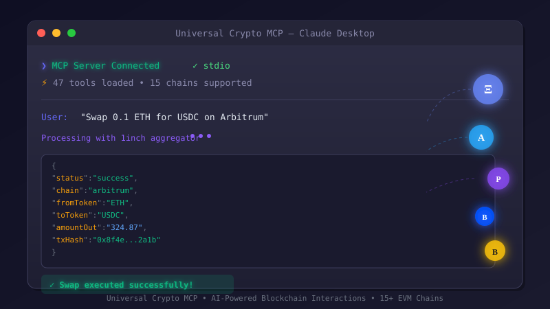

<p align="center">
  <picture>
    <source media="(prefers-color-scheme: dark)" srcset=".github/demo.svg">
    
  </picture>
</p>

<h1 align="center">Agenti</h1>

<p align="center">
  <strong>The Universal MCP Server for Blockchain &amp; DeFi</strong><br>
  380+ tools &middot; 20+ chains &middot; x402 payments &middot; one command
</p>

<p align="center">
  <a href="https://www.npmjs.com/package/@nirholas/agenti"></a>
  <a href="https://modelcontextprotocol.io"></a>
  <a href="https://www.typescriptlang.org/"></a>
  <a href="LICENSE"></a>
</p>

<p align="center">
  <a href="#quick-start">Quick Start</a> &middot;
  <a href="https://mcp.giving">Documentation</a> &middot;
  <a href="ROADMAP.md">Roadmap</a> &middot;
  <a href="CONTRIBUTING.md">Contributing</a> &middot;
  <a href="https://x.com/nichxbt">Follow on X</a>
</p>

---

## What is Agenti?

Agenti is an open-source [Model Context Protocol](https://modelcontextprotocol.io) server that connects AI assistants to blockchain networks through natural language. It provides **380+ tools** for DeFi, trading, security analysis, and cross-chain operations across **20+ networks**.

```bash
npx @nirholas/agenti
```

**Works with:** Claude Desktop, ChatGPT, Cursor, and any MCP-compatible client.

---

## Why Agenti?

| | Agenti | Other MCP Servers |
|---|---|---|
| **Tools** | 380+ | 10-50 |
| **Chains** | 20+ (EVM + Solana, Cosmos, Near, Sui, Aptos) | 1-3 |
| **DEX Aggregation** | 1inch, 0x, ParaSwap | Single or none |
| **Security** | GoPlus, honeypot, rug pull detection | Basic or none |
| **DeFi** | Aave, Compound, Lido, Uniswap | Limited |
| **Bridges** | LayerZero, Stargate, Wormhole | None |
| **AI Payments** | x402 protocol built-in | None |
| **Transport** | stdio, HTTP, SSE | Usually stdio only |

---

## Quick Start

### Claude Desktop

Add to `claude_desktop_config.json`:

```json
{
  "mcpServers": {
    "agenti": {
      "command": "npx",
      "args": ["-y", "@nirholas/agenti@latest"],
      "env": {
        "PRIVATE_KEY": "your_private_key_here"
      }
    }
  }
}
```

### Cursor

Add to your MCP settings with the same configuration as above.

### ChatGPT

1. Enable [Developer Mode](https://chatgpt.com/#settings/Connectors/Advanced) in settings
2. Run: `npx @nirholas/agenti@latest --http`
3. In ChatGPT Settings > Apps > Create app, enter: `http://localhost:3001/mcp`

See the full [ChatGPT Setup Guide](https://mcp.giving/mcp-server/chatgpt-setup/) for details.

### Server Modes

| Mode | Command | Client |
|------|---------|--------|
| stdio | `npx @nirholas/agenti` | Claude Desktop, Cursor |
| HTTP | `npx @nirholas/agenti --http` | ChatGPT |
| SSE | `npx @nirholas/agenti --sse` | Legacy HTTP clients |

---

## Supported Networks

### EVM Chains
Ethereum, Arbitrum, Base, Optimism, Polygon, BNB Chain, Avalanche, Fantom, zkSync Era, Linea, Scroll, Blast, Mode, Mantle, opBNB, and all testnets.

### Multi-Chain
Solana, Cosmos/IBC, Near, Sui, Aptos, TON, XRP Ledger, Bitcoin, Litecoin, THORChain.

---

## Features

### DeFi Operations
- **Swaps** &mdash; Token swaps via 1inch, 0x, ParaSwap with MEV protection
- **Lending** &mdash; Aave, Compound positions and rates
- **Staking** &mdash; Liquid staking (Lido), LP farming, yield optimization
- **Bridges** &mdash; Cross-chain via LayerZero, Stargate, Wormhole

### Market Intelligence
- **Prices** &mdash; CoinGecko, CoinStats, oracle aggregation, TWAP
- **Analytics** &mdash; DefiLlama TVL, yields, fees, protocol metrics
- **Technical Analysis** &mdash; 50+ indicators (RSI, MACD, Bollinger Bands, etc.)
- **Social Sentiment** &mdash; LunarCrush metrics, trending topics
- **News** &mdash; Real-time crypto news aggregation

### Security & Analysis
- **Token Safety** &mdash; GoPlus security checks, honeypot detection, rug pull scanning
- **Wallet Security** &mdash; Approval auditing, drainer detection, risk scoring
- **Contract Analysis** &mdash; Proxy detection, source verification, malicious function detection

### Infrastructure
- **ENS/Domains** &mdash; Register, resolve, manage domains and subdomains
- **Governance** &mdash; Snapshot votes, on-chain proposals, delegation
- **Deployment** &mdash; CREATE2, upgradeable proxies, contract verification
- **Real-time** &mdash; WebSocket price streams, trade feeds, mempool monitoring
- **Portfolio** &mdash; Cross-chain tracking, whale analytics, wallet scoring

---

## x402 Payment Protocol

AI agents can now make and receive cryptocurrency payments autonomously.

```
User: "Get premium weather data for Tokyo"

Claude: Checking x402 balance... $45.23 USDs
        Paying $0.01 for premium API access...
        Payment confirmed! Here's your detailed forecast...
```

### Capabilities

- **Pay for APIs** &mdash; Automatic HTTP 402 payment handling
- **Autonomous Payments** &mdash; No human approval needed
- **Earn Yield** &mdash; Payments use USDs stablecoin (~5% APY)
- **Multi-chain** &mdash; EVM chains + Solana

### Setup

```bash
export X402_PRIVATE_KEY=0x...
export X402_CHAIN=arbitrum  # or base, ethereum, polygon
```

### x402 Tools

| Tool | Description |
|------|-------------|
| `x402_pay_request` | HTTP request with automatic 402 payment |
| `x402_balance` | Check wallet balance (USDC/USDs + native) |
| `x402_send` | Send direct payment |
| `x402_batch_send` | Send multiple payments in one transaction |
| `x402_gasless_send` | Send payment without paying gas |
| `x402_estimate` | Check cost before paying |
| `x402_address` | Get wallet address |
| `x402_networks` | List supported networks |
| `x402_yield` | Check USDs auto-yield earnings |
| `x402_apy` | Get current APY rate |
| `x402_yield_estimate` | Project future yield |
| `x402_approve` | Approve token spending |
| `x402_tx_status` | Check transaction status |
| `x402_config` | View current configuration |

### Supported Networks

| Network | CAIP-2 | Status |
|---------|--------|--------|
| Base | `eip155:8453` | Recommended |
| Arbitrum | `eip155:42161` | Supported |
| Ethereum | `eip155:1` | Supported |
| Polygon | `eip155:137` | Supported |
| Solana | `solana:mainnet` | Supported |

Full x402 documentation: [Overview](x402/README.md) | [Quickstart](x402/docs/QUICKSTART.md) | [Tools Reference](x402/docs/MCP_TOOLS.md) | [Architecture](x402/docs/ARCHITECTURE.md) | [Security](x402/docs/SECURITY.md)

---

## Example Prompts

### Trading & DeFi

```
Swap 0.1 ETH for USDC on Arbitrum
What's the best rate to swap 500 DAI to ETH across all DEXs?
Show me Aave lending rates for USDC on Arbitrum
Bridge 100 USDC from Ethereum to Arbitrum
```

### Market Analysis

```
What's the current price of Bitcoin and Ethereum?
Show me the top 10 trending coins on CoinGecko
Calculate RSI for Bitcoin over the last 14 days
What's the social sentiment for Bitcoin right now?
```

### Security

```
Is this token safe? 0x95aD61b0a150d79219dCF64E1E6Cc01f0B64C4cE
Check if this token is a honeypot on BSC
Scan my wallet for risky approvals: 0xYourAddress
```

### Portfolio & Analytics

```
Show my token balances on Ethereum: 0xYourAddress
What's the total TVL of Aave across all chains?
Track my portfolio across all EVM chains
Get all Transfer events for USDC in the last 100 blocks
```

For 100+ more prompts, see the [Prompts Guide](https://mcp.giving/prompts/).

---

## Configuration

### Environment Variables

```bash
# Required for write operations (swaps, transfers, etc.)
PRIVATE_KEY=your_private_key_here

# Market data (optional - free tier available)
COINGECKO_API_KEY=your_key
COINSTATS_API_KEY=your_key

# Social & news (optional)
LUNARCRUSH_API_KEY=your_key
CRYPTOPANIC_API_KEY=your_key

# Cross-chain (optional)
RUBIC_API_KEY=your_key

# Custom RPCs (optional - uses public RPCs by default)
ETHEREUM_RPC_URL=https://mainnet.infura.io/v3/YOUR_KEY
ARBITRUM_RPC_URL=https://arb1.arbitrum.io/rpc
```

### What Works Without API Keys

| Feature | Free | With API Key |
|---------|------|-------------|
| Token prices (CoinGecko) | Yes | Higher rate limits |
| DeFi analytics (DefiLlama) | Yes | - |
| Security checks (GoPlus) | Yes | - |
| DEX analytics (GeckoTerminal) | Yes | - |
| Social sentiment | No | LunarCrush |
| Crypto news | No | CryptoPanic |

---

## Development

```bash
git clone https://github.com/nirholas/agenti
cd agenti
npm install

npm run dev          # stdio mode (Claude)
npm run dev:http     # HTTP mode (ChatGPT)
npm run dev:sse      # SSE mode (legacy)
```

### Testing

```bash
npm test                # Unit tests
npm run test:e2e        # End-to-end tests
npm run test:coverage   # Coverage report
npm run test:watch      # Watch mode
npm run test:inspector  # MCP Inspector UI
```

### Project Structure

```
src/
├── index.ts              # Entry point
├── cli.ts                # CLI handler
├── evm/                  # EVM blockchain modules
│   ├── modules/          # Swap, bridge, staking, lending, etc.
│   └── services/         # Shared services
├── modules/              # Non-EVM modules (23 total)
├── server/               # Transport layer (stdio, HTTP, SSE)
├── vendors/              # Third-party API integrations
├── x402/                 # Payment protocol
└── utils/                # Shared utilities

packages/                 # Monorepo packages
├── chains/               # Chain-specific servers
├── data/                 # Data aggregation
├── exchanges/            # Exchange integrations
├── protocols/            # Protocol-specific tools
├── wallets/              # Wallet toolkits
└── ...                   # 14 package categories total
```

---

## Data Sources

| Provider | Data Type | API Key |
|----------|-----------|---------|
| [CoinGecko](https://coingecko.com) | Prices, OHLCV, trending | Optional |
| [DefiLlama](https://defillama.com) | TVL, yields, fees, protocols | No |
| [GoPlus](https://gopluslabs.io) | Security analysis, honeypot detection | No |
| [GeckoTerminal](https://geckoterminal.com) | DEX pools, trades, OHLCV | No |
| [DexPaprika](https://dexpaprika.com) | DEX analytics | No |
| [LunarCrush](https://lunarcrush.com) | Social sentiment | Yes |
| [CryptoPanic](https://cryptopanic.com) | Crypto news | Yes |
| [CoinStats](https://coinstats.app) | Portfolio, wallets | Yes |
| [Alternative.me](https://alternative.me) | Fear & Greed Index | No |

---

## Related Servers

| Server | Description | Tools |
|--------|-------------|-------|
| [binance-mcp-server](./binance-mcp-server/) | Binance.com global exchange | 156+ |
| [binance-us-mcp-server](./binance-us-mcp-server/) | Binance.US exchange | 71+ |

---

## Who's Using Agenti?

- **AI Trading Bots** &mdash; Automated portfolio management
- **Analytics Dashboards** &mdash; DeFi monitoring tools
- **Security Auditors** &mdash; Token vetting workflows
- **DeFi Applications** &mdash; Cross-chain operations
- **Educational Platforms** &mdash; Blockchain learning tools

Using Agenti? [Let us know!](https://github.com/nirholas/agenti/issues/new?title=Add%20my%20project%20to%20Who's%20Using%20This)

---

## Contributing

We welcome contributions! See the [Contributing Guide](CONTRIBUTING.md) for full details.

```bash
git clone https://github.com/YOUR_USERNAME/agenti.git && cd agenti
npm install
git checkout -b feat/your-feature
# Make changes, then:
npm run lint && npm test
git commit -m "feat(module): add new feature"
```

- [Report bugs](https://github.com/nirholas/agenti/issues/new?template=bug_report.yml)
- [Request features](https://github.com/nirholas/agenti/issues/new?template=feature_request.yml)
- [View roadmap](ROADMAP.md)

---

## Documentation

Full documentation at **[mcp.giving](https://mcp.giving)**.

| Guide | Description |
|-------|-------------|
| [Quick Start](https://mcp.giving/mcp-server/quickstart/) | Get up and running |
| [Architecture](https://mcp.giving/mcp-server/architecture/) | System design deep dive |
| [API Reference](https://mcp.giving/mcp-server/api-reference/) | Complete tool reference |
| [Tutorials](https://mcp.giving/tutorials/) | Step-by-step guides |
| [FAQ](https://mcp.giving/faq/) | Common questions answered |

---

## License

Apache-2.0 &copy; [nich](https://github.com/nirholas)

<p align="center">
  <a href="https://github.com/nirholas/agenti/stargazers"></a>
</p>

<details>
<summary>.</summary>
# ERC-8004 Keywords & SEO Terms

> Comprehensive keyword list for ERC-8004 Trustless Agents ecosystem

---

## Core Protocol Keywords

ERC-8004, ERC8004, EIP-8004, EIP8004, Trustless Agents, trustless agent, trustless AI, trustless AI agents, agent protocol, agent standard, Ethereum agent standard, blockchain agent protocol, on-chain agents, onchain agents, on-chain AI, onchain AI, decentralized agents, decentralized AI agents, autonomous agents, autonomous AI agents, AI agent protocol, AI agent standard, agent discovery, agent trust, agent reputation, agent validation, agent identity, agent registry, identity registry, reputation registry, validation registry, agent NFT, ERC-721 agent, agent tokenId, agentId, agentURI, agentWallet, agent registration, agent registration file, agent-registration.json, agent card, agent metadata, agent endpoints, agent discovery protocol, agent trust protocol, open agent protocol, open agent standard, permissionless agents, permissionless AI, censorship-resistant agents, portable agent identity, portable AI identity, verifiable agents, verifiable AI agents, accountable agents, accountable AI, agent accountability

## Blockchain & Web3 Keywords

Ethereum, Ethereum mainnet, ETH, EVM, Ethereum Virtual Machine, smart contracts, Solidity, blockchain, decentralized, permissionless, trustless, on-chain, onchain, L2, Layer 2, Base, Optimism, Polygon, Linea, Arbitrum, Scroll, Monad, Gnosis, Celo, Sepolia, testnet, mainnet, singleton contracts, singleton deployment, ERC-721, NFT, non-fungible token, tokenURI, URIStorage, EIP-712, ERC-1271, wallet signature, EOA, smart contract wallet, gas fees, gas sponsorship, EIP-7702, subgraph, The Graph, indexer, blockchain indexing, IPFS, decentralized storage, content-addressed, immutable data, public registry, public good, credibly neutral, credibly neutral infrastructure, open protocol, open standard, Web3, crypto, cryptocurrency, DeFi, decentralized finance

## AI & Agent Technology Keywords

AI agents, artificial intelligence agents, autonomous AI, AI autonomy, LLM agents, large language model agents, machine learning agents, ML agents, AI assistant, AI chatbot, intelligent agents, software agents, digital agents, virtual agents, AI automation, automated agents, agent-to-agent, A2A, A2A protocol, Google A2A, Agent2Agent, MCP, Model Context Protocol, agent communication, agent interoperability, agent orchestration, agent collaboration, multi-agent, multi-agent systems, agent capabilities, agent skills, agent tools, agent prompts, agent resources, agent completions, AgentCard, agent card, agent endpoint, agent service, AI service, AI API, agent API, AI infrastructure, agent infrastructure, agentic, agentic web, agentic economy, agentic commerce, agent economy, agent marketplace, AI marketplace, agent platform, AI platform

## Trust & Reputation Keywords

trust, trustless, reputation, reputation system, reputation protocol, reputation registry, feedback, client feedback, user feedback, on-chain feedback, on-chain reputation, verifiable reputation, portable reputation, reputation aggregation, reputation scoring, reputation algorithm, trust signals, trust model, trust verification, trust layer, recursive reputation, reviewer reputation, spam prevention, Sybil attack, Sybil resistance, anti-spam, feedback filtering, trusted reviewers, rating, rating system, quality rating, starred rating, uptime rating, success rate, response time, performance history, track record, audit trail, immutable feedback, permanent feedback, feedback response, appendResponse, giveFeedback, revokeFeedback, feedback tags, feedback value, valueDecimals, feedbackURI, feedbackHash, clientAddress, reviewer address

## Validation & Verification Keywords

validation, validation registry, validator, validator contract, cryptographic validation, cryptographic proof, cryptographic attestation, zero-knowledge, ZK, zkML, zero-knowledge machine learning, ZK proofs, trusted execution environment, TEE, TEE attestation, TEE oracle, stake-secured, staking validators, crypto-economic security, inference re-execution, output validation, work verification, third-party validation, independent validation, validation request, validation response, validationRequest, validationResponse, requestHash, responseHash, verifiable computation, verified agents, verified behavior, behavioral validation, agent verification

## Payment & Commerce Keywords

x402, x402 protocol, x402 payments, programmable payments, micropayments, HTTP payments, pay-per-request, pay-per-task, agent payments, AI payments, agent monetization, AI monetization, agent commerce, AI commerce, agentic commerce, agent economy, AI economy, agent marketplace, service marketplace, agent-to-agent payments, A2A payments, stablecoin payments, USDC, crypto payments, on-chain payments, payment settlement, programmable settlement, proof of payment, proofOfPayment, payment receipt, payment verification, Coinbase, Coinbase x402, agent pricing, API pricing, service pricing, subscription, API keys, revenue, trading yield, cumulative revenues, agent wallet, payment address, toAddress, fromAddress, txHash

## Discovery & Registry Keywords

agent discovery, service discovery, agent registry, identity registry, agent registration, register agent, mint agent, agent NFT, agent tokenId, agent browsing, agent explorer, agent scanner, 8004scan, 8004scan.io, agentscan, agentscan.info, 8004agents, 8004agents.ai, agent leaderboard, agent ranking, top agents, agent listing, agent directory, agent catalog, agent index, browse agents, search agents, find agents, discover agents, agent visibility, agent discoverability, no-code registration, agent creation, create agent, my agents, agent owner, agent operator, agent transfer, transferable agent, portable agent

## Endpoints & Integration Keywords

endpoint, agent endpoint, service endpoint, API endpoint, MCP endpoint, A2A endpoint, web endpoint, HTTPS endpoint, HTTP endpoint, DID, decentralized identifier, ENS, Ethereum Name Service, ENS name, agent.eth, vitalik.eth, email endpoint, OASF, Open Agent Specification Format, endpoint verification, domain verification, endpoint ownership, .well-known, well-known, agent-registration.json, endpoint domain, endpoint URL, endpoint URI, base64 data URI, on-chain metadata, off-chain metadata, metadata storage, JSON metadata, agent JSON, registration JSON

## SDK & Developer Tools Keywords

SDK, Agent0 SDK, Agent0, ChaosChain SDK, ChaosChain, Lucid Agents, Daydreams AI, create-8004-agent, npm, TypeScript SDK, Python SDK, JavaScript, Solidity, smart contract, ABI, contract ABI, deployed contracts, contract addresses, Hardhat, development tools, developer tools, dev tools, API, REST API, GraphQL, subgraph, The Graph, indexer, blockchain explorer, Etherscan, contract verification, open source, MIT license, CC0, public domain, GitHub, repository, code repository, documentation, docs, best practices, reference implementation

## Ecosystem & Community Keywords

ecosystem, community, builder, builders, developer, developers, contributor, contributors, partner, partners, collaborator, collaborators, co-author, co-authors, MetaMask, Ethereum Foundation, Google, Coinbase, Consensys, AltLayer, Virtuals Protocol, Olas, EigenLayer, Phala, ElizaOS, Flashbots, Polygon, Base, Optimism, Arbitrum, Scroll, Linea, Monad, Gnosis, Celo, Near Protocol, Filecoin, Worldcoin, ThirdWeb, ENS, Collab.land, DappRadar, Giza Tech, Theoriq, OpenServ, Questflow, Semantic, Semiotic, Cambrian, Nevermined, Oasis, Towns Protocol, Warden Protocol, Terminal3, Pinata Cloud, Silence Labs, Rena Labs, Index Network, Trusta Network, Turf Network

## Key People & Organizations Keywords

Marco De Rossi, MetaMask AI Lead, Davide Crapis, Ethereum Foundation AI, Head of AI, Jordan Ellis, Google engineer, Erik Reppel, Coinbase engineering, Head of Engineering, Sumeet Chougule, ChaosChain founder, YQ, AltLayer co-founder, Wee Kee, Virtuals contributor, Cyfrin audit, Nethermind audit, Ethereum Foundation Security Team, security audit, audited contracts

## Use Cases & Applications Keywords

trading bot, DeFi agent, yield optimizer, data oracle, price feed, analytics agent, research agent, coding agent, development agent, automation agent, task agent, workflow agent, portfolio management, asset management, supply chain, service agent, API service, chatbot, AI assistant, virtual assistant, personal agent, enterprise agent, B2B agent, agent-as-a-service, AaaS, SaaS agent, AI SaaS, delegated agent, proxy agent, helper agent, worker agent, coordinator agent, orchestrator agent, validator agent, auditor agent, insurance agent, scoring agent, ranking agent

## Technical Specifications Keywords

ERC-8004 specification, EIP specification, Ethereum Improvement Proposal, Ethereum Request for Comment, RFC 2119, RFC 8174, MUST, SHOULD, MAY, OPTIONAL, REQUIRED, interface, contract interface, function signature, event, emit event, indexed event, storage, contract storage, view function, external function, public function, uint256, int128, uint8, uint64, bytes32, string, address, array, struct, MetadataEntry, mapping, modifier, require, revert, transfer, approve, operator, owner, tokenId, URI, hash, keccak256, KECCAK-256, signature, deadline

## Events & Conferences Keywords

8004 Launch Day, Agentic Brunch, Builder Nights Denver, Trustless Agent Day, Devconnect, ETHDenver, community call, meetup, hackathon, workshop, conference, summit, builder program, grants, bounties, ecosystem fund

## News & Media Keywords

announcement, launch, mainnet launch, testnet launch, protocol update, upgrade, security review, audit, milestone, breaking news, ecosystem news, agent news, AI news, blockchain news, Web3 news, crypto news, DeFi news, newsletter, blog, article, press release, media coverage

## Competitor & Alternative Keywords

agent framework, agent platform, AI platform, centralized agents, closed agents, proprietary agents, gatekeeper, intermediary, platform lock-in, vendor lock-in, data silos, walled garden, open alternative, decentralized alternative, permissionless alternative, trustless alternative

## Future & Roadmap Keywords

cross-chain, multi-chain, chain agnostic, bridge, interoperability, governance, community governance, decentralized governance, DAO, protocol upgrade, upgradeable contracts, UUPS, proxy contract, ERC1967Proxy, protocol evolution, standard finalization, EIP finalization, mainnet feedback, testnet feedback, security improvements, gas optimization, feature request, enhancement, proposal

---

## Long-tail Keywords & Phrases

how to register AI agent on blockchain, how to create ERC-8004 agent, how to build trustless AI agent, how to verify agent reputation, how to give feedback to AI agent, how to monetize AI agent, how to accept crypto payments AI agent, how to discover AI agents, how to trust AI agents, how to validate AI agent output, decentralized AI agent marketplace, on-chain AI agent registry, blockchain-based AI reputation, verifiable AI agent identity, portable AI agent reputation, permissionless AI agent registration, trustless AI agent discovery, autonomous AI agent payments, agent-to-agent micropayments, AI agent service discovery, AI agent trust protocol, open source AI agent standard, Ethereum AI agent protocol, EVM AI agent standard, blockchain AI agent framework, decentralized AI agent infrastructure, Web3 AI agent ecosystem, crypto AI agent platform, DeFi AI agent integration, NFT-based agent identity, ERC-721 agent registration, on-chain agent metadata, off-chain agent data, IPFS agent storage, subgraph agent indexing, agent explorer blockchain, agent scanner Ethereum, agent leaderboard ranking, agent reputation scoring, agent feedback system, agent validation proof, zkML agent verification, TEE agent attestation, stake-secured agent validation, x402 agent payments, MCP agent endpoint, A2A agent protocol, ENS agent name, DID agent identity, agent wallet address, agent owner operator, transferable agent NFT, portable agent identity, censorship-resistant agent registry, credibly neutral agent infrastructure, public good agent data, open agent economy, agentic web infrastructure, trustless agentic commerce, autonomous agent economy, AI agent economic actors, accountable AI agents, verifiable AI behavior, auditable AI agents, transparent AI agents, decentralized AI governance, community-driven AI standards, open protocol AI agents, permissionless AI innovation

---

## Brand & Product Keywords

8004, 8004.org, Trustless Agents, trustlessagents, trustless-agents, 8004scan, 8004scan.io, agentscan, agentscan.info, 8004agents, 8004agents.ai, Agent0, agent0, sdk.ag0.xyz, ChaosChain, chaoschain, docs.chaoscha.in, Lucid Agents, lucid-agents, daydreams.systems, create-8004-agent, erc-8004-contracts, best-practices, agent0lab, subgraph

---

## Hashtags & Social Keywords

#ERC8004, #TrustlessAgents, #AIAgents, #DecentralizedAI, #OnChainAI, #AgenticWeb, #AgentEconomy, #Web3AI, #BlockchainAI, #EthereumAI, #CryptoAI, #AutonomousAgents, #AIAutonomy, #AgentDiscovery, #AgentTrust, #AgentReputation, #x402, #MCP, #A2A, #AgentProtocol, #OpenAgents, #PermissionlessAI, #VerifiableAI, #AccountableAI, #AIInfrastructure, #AgentInfrastructure, #BuildWithAgents, #AgentBuilders, #AgentDevelopers, #AgentEcosystem

---

## Statistical Keywords

10000+ agents, 10300+ agents, 10000+ testnet registrations, 20000+ feedback, 5 months development, 80+ teams, 100+ partners, January 28 2026, January 29 2026, mainnet live, production ready, audited contracts, singleton deployment, per-chain singleton, ERC-721 token, NFT minting, gas fees, $5-20 mainnet gas

</details>
