🌐 **اللغة:** [English](README.md) | [Español](README.es.md) | [Français](README.fr.md) | [Deutsch](README.de.md) | [Português](README.pt.md) | [日本語](README.ja.md) | [简体中文](README.zh-CN.md) | [繁體中文](README.zh-TW.md) | [한국어](README.ko.md) | [العربية](README.ar.md) | [Русский](README.ru.md) | [Italiano](README.it.md) | [Nederlands](README.nl.md) | [Polski](README.pl.md) | [Türkçe](README.tr.md) | [Tiếng Việt](README.vi.md) | [ไทย](README.th.md) | [Bahasa Indonesia](README.id.md)

---

<div dir="rtl">

# 🆓 واجهة برمجة تطبيقات أخبار العملات المشفرة المجانية

<p align="center">
  <a href="https://github.com/nirholas/free-crypto-news/stargazers"></a>
  <a href="https://github.com/nirholas/free-crypto-news/blob/main/LICENSE"></a>
  <a href="https://github.com/nirholas/free-crypto-news/actions/workflows/ci.yml"></a>
</p>

<p align="center">
  
</p>

> ⭐ **إذا وجدت هذا مفيدًا، يرجى إعطاء نجمة للمستودع!** هذا يساعد الآخرين على اكتشاف هذا المشروع ويحفز على التطوير المستمر.

---
احصل على أخبار العملات المشفرة في الوقت الفعلي من 7 مصادر رئيسية باستدعاء API واحد.

```bash
curl https://free-crypto-news.vercel.app/api/news
```
---

| | Free Crypto News | CryptoPanic | أخرى |
|---|---|---|---|
| **السعر** | 🆓 مجاني للأبد | $29-299/شهر | مدفوع |
| **مفتاح API** | ❌ غير مطلوب | مطلوب | مطلوب |
| **حد الطلبات** | غير محدود* | 100-1000/يوم | محدود |
| **المصادر** | 12 إنجليزي + 12 دولي | 1 | متنوع |
| **التدويل** | 🌏 كوري، صيني، ياباني، إسباني + ترجمة | لا | لا |
| **استضافة ذاتية** | ✅ نشر بنقرة واحدة | لا | لا |
| **PWA** | ✅ قابل للتثبيت | لا | لا |
| **MCP** | ✅ Claude + ChatGPT | لا | لا |

---

## 🌍 مصادر الأخبار الدولية

احصل على أخبار العملات المشفرة من **12 مصدرًا دوليًا** بالكورية والصينية واليابانية والإسبانية — مترجمة تلقائيًا للإنجليزية!

### المصادر المدعومة

| المنطقة | المصادر |
|--------|---------|
| 🇰🇷 **كوريا** | Block Media, TokenPost, CoinDesk Korea |
| 🇨🇳 **الصين** | 8BTC (باييت), Jinse Finance (جينسي), Odaily (أوديلي) |
| 🇯🇵 **اليابان** | CoinPost, CoinDesk Japan, Cointelegraph Japan |
| 🇪🇸 **أمريكا اللاتينية** | Cointelegraph Español, Diario Bitcoin, CriptoNoticias |

### أمثلة سريعة

```bash
# الحصول على جميع الأخبار الدولية
curl "https://free-crypto-news.vercel.app/api/news/international"

# الحصول على أخبار كورية مترجمة للإنجليزية
curl "https://free-crypto-news.vercel.app/api/news/international?language=ko&translate=true"

# الحصول على أخبار منطقة آسيا
curl "https://free-crypto-news.vercel.app/api/news/international?region=asia&limit=20"
```

### الميزات

- ✅ **ترجمة تلقائية** للإنجليزية عبر Groq AI
- ✅ **تخزين مؤقت للترجمة 7 أيام** للكفاءة
- ✅ الحفاظ على **النص الأصلي + الإنجليزي**
- ✅ **تحديد المعدل** (1 طلب/ثانية) احترامًا للـ APIs
- ✅ **تراجع سلس** للمصادر غير المتاحة
- ✅ **إزالة التكرار** عبر المصادر

---

## 📱 تطبيق ويب تقدمي (PWA)

Free Crypto News هو **PWA قابل للتثبيت بالكامل** مع دعم دون اتصال!

### الميزات

| الميزة | الوصف |
|---------|-------------|
| 📲 **قابل للتثبيت** | أضف إلى الشاشة الرئيسية على أي جهاز |
| 📴 **وضع دون اتصال** | اقرأ الأخبار المخزنة مؤقتًا بدون شبكة |
| 🔔 **إشعارات الدفع** | تلقي تنبيهات الأخبار العاجلة |
| ⚡ **سريع جدًا** | استراتيجيات تخزين مؤقت عدوانية |
| 🔄 **مزامنة في الخلفية** | تحديث تلقائي عند العودة للاتصال |

### تثبيت التطبيق

**سطح المكتب (Chrome/Edge):**
1. قم بزيارة [free-crypto-news.vercel.app](https://free-crypto-news.vercel.app)
2. انقر على أيقونة التثبيت (⊕) في شريط URL
3. انقر "تثبيت"

**iOS Safari:**
1. قم بزيارة الموقع في Safari
2. اضغط على مشاركة (📤) → "إضافة إلى الشاشة الرئيسية"

**Android Chrome:**
1. قم بزيارة الموقع
2. اضغط على لافتة التثبيت أو القائمة → "تثبيت التطبيق"

---

## المصادر

نجمع من **7 وسائل إعلام موثوقة**:

- 🟠 **CoinDesk** — أخبار العملات المشفرة العامة
- 🔵 **The Block** — المؤسسات والأبحاث
- 🟢 **Decrypt** — Web3 والثقافة
- 🟡 **CoinTelegraph** — أخبار العملات المشفرة العالمية
- 🟤 **Bitcoin Magazine** — متطرفو البيتكوين
- 🟣 **Blockworks** — DeFi والمؤسسات
- 🔴 **The Defiant** — DeFi الأصلي

---

## نقاط النهاية

| نقطة النهاية | الوصف |
|----------|-------------|
| `/api/news` | آخر الأخبار من جميع المصادر |
| `/api/search?q=bitcoin` | البحث بكلمة مفتاحية |
| `/api/defi` | أخبار متعلقة بـ DeFi |
| `/api/bitcoin` | أخبار متعلقة بـ Bitcoin |
| `/api/breaking` | آخر ساعتين فقط |
| `/api/trending` | المواضيع الرائجة مع تحليل المشاعر |
| `/api/analyze` | الأخبار مع تصنيف المواضيع |
| `/api/stats` | التحليلات والإحصائيات |

### 🤖 نقاط نهاية مدعومة بالذكاء الاصطناعي (مجاني عبر Groq)

| نقطة النهاية | الوصف |
|----------|-------------|
| `/api/summarize` | تلخيص AI للمقالات |
| `/api/ask?q=...` | اسأل أسئلة عن أخبار العملات المشفرة |
| `/api/digest` | ملخص يومي مُنشأ بالذكاء الاصطناعي |
| `/api/sentiment` | تحليل مشاعر عميق لكل مقال |

---

## حزم SDK والمكونات

| الحزمة | الوصف |
|---------|-------------|
| [React](sdk/react/) | مكون `<CryptoNews />` جاهز للاستخدام |
| [TypeScript](sdk/typescript/) | حزمة TypeScript SDK كاملة |
| [Python](sdk/python/) | عميل Python بدون تبعيات |
| [JavaScript](sdk/javascript/) | حزمة SDK للمتصفح و Node.js |
| [Go](sdk/go/) | مكتبة عميل Go |
| [PHP](sdk/php/) | حزمة PHP SDK |

**عنوان URL الأساسي:** `https://free-crypto-news.vercel.app`

---

# الاستضافة الذاتية

## نشر بنقرة واحدة

[](https://vercel.com/new/clone?repository-url=https%3A%2F%2Fgithub.com%2Fnirholas%2Ffree-crypto-news)

## يدوي

```bash
git clone https://github.com/nirholas/free-crypto-news.git
cd free-crypto-news
pnpm install
pnpm dev
```

افتح http://localhost:3000/api/news

---

# الترخيص

MIT © 2025 [nich](https://github.com/nirholas)

---

<p align="center">
  <b>توقف عن الدفع مقابل واجهات برمجة تطبيقات أخبار العملات المشفرة.</b><br>
  <sub>صُنع بـ 💜 للمجتمع</sub>
</p>

<p align="center">
  <br>
  ⭐ <b>وجدته مفيدًا؟ أعطنا نجمة!</b> ⭐<br>
  <a href="https://github.com/nirholas/free-crypto-news/stargazers">
    
  </a>
</p>

</div>
