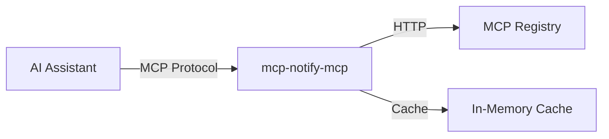

# MCP Server Setup

The MCP server component allows AI assistants to query the MCP Registry directly.

## Installation

### From Source

```bash
go install github.com/nirholas/mcp-notify/cmd/mcp-notify-mcp@latest
```

### From Binary

Download from [GitHub Releases](https://github.com/nirholas/mcp-notify/releases).

## Running Standalone

The MCP server uses stdio transport by default:

```bash
# Run directly (for testing)
echo '{"method":"tools/list"}' | mcp-notify-mcp
```

## Configuration

The MCP server can be configured via environment variables:

| Variable | Description | Default |
|----------|-------------|---------|
| `MCP_REGISTRY_URL` | MCP Registry URL | Official registry |
| `MCP_CACHE_TTL` | Cache duration | `5m` |
| `MCP_LOG_LEVEL` | Log level | `info` |

## Integration Options

### Claude Desktop

See [Claude Desktop Setup](claude-desktop.md) for detailed instructions.

```json
{
  "mcpServers": {
    "mcp-notify": {
      "command": "mcp-notify-mcp"
    }
  }
}
```

### Other MCP Clients

The server implements the standard MCP protocol over stdio. It can be used with any MCP-compatible client.

### With Arguments

Pass a custom registry URL:

```json
{
  "mcpServers": {
    "mcp-notify": {
      "command": "mcp-notify-mcp",
      "env": {
        "MCP_REGISTRY_URL": "https://custom-registry.example.com"
      }
    }
  }
}
```

## Architecture



The MCP server:

1. Receives tool calls via stdio
2. Checks in-memory cache
3. Queries the MCP Registry if needed
4. Returns structured results

## Logging

Enable debug logging:

```bash
MCP_LOG_LEVEL=debug mcp-notify-mcp
```

Logs are written to stderr (as required by MCP protocol).
