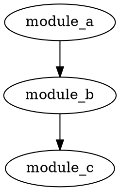

# Lyra Intel API Documentation

Complete REST API reference for Lyra Intel.

## Base URL

```
http://localhost:8080/api/v1
```

## Authentication

API supports multiple authentication methods:

### API Key (Recommended)

```bash
curl -H "X-API-Key: your-api-key" http://localhost:8080/api/v1/analyze
```

### JWT Token

```bash
# Get token
curl -X POST http://localhost:8080/api/v1/auth/login \
  -H "Content-Type: application/json" \
  -d '{"username": "admin", "password": "password"}'

# Use token
curl -H "Authorization: Bearer <token>" http://localhost:8080/api/v1/analyze
```

## Endpoints

### Health Check

#### GET `/health`

Check API server health.

**Response:**
```json
{
  "status": "healthy",
  "version": "1.0.0",
  "timestamp": "2025-12-03T10:30:00Z"
}
```

---

### Analysis

#### POST `/analyze`

Start a new code analysis.

**Request:**
```json
{
  "repo_url": "/path/to/repo",
  "branch": "main",
  "features": ["security", "dependencies", "complexity"],
  "options": {
    "max_workers": 8,
    "enable_cache": true
  }
}
```

**Parameters:**
- `repo_url` (string, required): Path or URL to repository
- `branch` (string, optional): Branch name (default: "main")
- `features` (array, optional): Features to analyze
  - `security` - Security scanning
  - `dependencies` - Dependency analysis
  - `complexity` - Complexity metrics
  - `git-history` - Git history analysis
  - `patterns` - Pattern detection
  - `all` - All features
- `options` (object, optional): Analysis options

**Response:**
```json
{
  "analysis_id": "abc123def456",
  "status": "queued",
  "created_at": "2025-12-03T10:30:00Z"
}
```

**Status Codes:**
- `202` - Analysis queued successfully
- `400` - Invalid request
- `401` - Unauthorized
- `500` - Server error

---

#### GET `/analysis/{analysis_id}`

Get analysis status.

**Response:**
```json
{
  "analysis_id": "abc123def456",
  "status": "completed",
  "progress": 100,
  "created_at": "2025-12-03T10:30:00Z",
  "completed_at": "2025-12-03T10:35:00Z",
  "error": null
}
```

**Status Values:**
- `queued` - Waiting to start
- `running` - In progress
- `completed` - Finished successfully
- `failed` - Encountered error

---

#### GET `/analysis/{analysis_id}/results`

Get analysis results.

**Response:**
```json
{
  "analysis_id": "abc123def456",
  "repo_url": "/path/to/repo",
  "branch": "main",
  "metrics": {
    "total_files": 150,
    "total_lines": 45000,
    "total_functions": 523,
    "total_classes": 87,
    "complexity_avg": 8.3,
    "complexity_max": 45
  },
  "security": {
    "total_findings": 23,
    "by_severity": {
      "critical": 2,
      "high": 5,
      "medium": 11,
      "low": 5
    },
    "findings": [
      {
        "severity": "high",
        "type": "hardcoded-secret",
        "file": "src/config.py",
        "line": 15,
        "description": "Hardcoded API key detected",
        "recommendation": "Move to environment variable"
      }
    ]
  },
  "dependencies": {
    "total": 45,
    "direct": 12,
    "transitive": 33,
    "circular": []
  },
  "patterns": {
    "code_smells": 8,
    "anti_patterns": 3,
    "best_practices": 15
  }
}
```

---

### Security Scanning

#### POST `/security/scan`

Run security scan on repository.

**Request:**
```json
{
  "repo_url": "/path/to/repo",
  "severity": ["critical", "high"],
  "patterns": ["hardcoded-secrets", "sql-injection"]
}
```

**Response:**
```json
{
  "scan_id": "scan_xyz789",
  "total_findings": 7,
  "findings": [
    {
      "severity": "critical",
      "type": "sql-injection",
      "file": "src/database.py",
      "line": 42,
      "code": "cursor.execute(f\"SELECT * FROM users WHERE id={user_id}\")",
      "description": "SQL injection vulnerability",
      "recommendation": "Use parameterized queries",
      "cwe": "CWE-89"
    }
  ]
}
```

---

### Dependencies

#### GET `/dependencies`

Get dependency graph for repository.

**Query Parameters:**
- `repo_url` (required): Repository path
- `format` (optional): Output format (`json`, `dot`, `mermaid`)

**Response (JSON):**
```json
{
  "nodes": [
    {"id": "module_a", "type": "module"},
    {"id": "module_b", "type": "module"}
  ],
  "edges": [
    {"from": "module_a", "to": "module_b", "type": "imports"}
  ],
  "stats": {
    "total_modules": 45,
    "total_dependencies": 120,
    "circular_dependencies": 0
  }
}
```

**Response (DOT format):**


---

### Metrics

#### GET `/metrics`

Get code metrics for repository.

**Query Parameters:**
- `repo_url` (required)
- `branch` (optional)

**Response:**
```json
{
  "files": {
    "total": 150,
    "by_language": {
      "python": 80,
      "typescript": 45,
      "javascript": 25
    },
    "by_size": {
      "small": 100,
      "medium": 40,
      "large": 10
    }
  },
  "code": {
    "total_lines": 45000,
    "code_lines": 32000,
    "comment_lines": 8000,
    "blank_lines": 5000
  },
  "complexity": {
    "average": 8.3,
    "median": 5.0,
    "max": 45,
    "high_complexity_functions": 12
  },
  "functions": {
    "total": 523,
    "average_length": 15,
    "max_length": 250
  },
  "classes": {
    "total": 87,
    "average_methods": 6,
    "max_methods": 35
  }
}
```

---

### Git History

#### GET `/git/history`

Get commit history analysis.

**Query Parameters:**
- `repo_url` (required)
- `branch` (optional)
- `max_commits` (optional): Limit number of commits

**Response:**
```json
{
  "total_commits": 250,
  "date_range": {
    "first": "2024-01-15T10:00:00Z",
    "last": "2025-12-03T10:30:00Z"
  },
  "contributors": [
    {
      "name": "Alice Smith",
      "email": "alice@example.com",
      "commits": 120,
      "insertions": 15000,
      "deletions": 3000
    }
  ],
  "activity": {
    "commits_per_day": 2.5,
    "most_active_day": "2025-11-15",
    "quiet_periods": []
  }
}
```

---

### Reports

#### POST `/report/generate`

Generate analysis report.

**Request:**
```json
{
  "analysis_id": "abc123def456",
  "format": "html",
  "sections": ["executive", "security", "metrics"]
}
```

**Formats:**
- `html` - Interactive HTML report
- `pdf` - PDF document
- `markdown` - Markdown document
- `json` - Raw JSON data

**Response:**
```json
{
  "report_id": "report_xyz",
  "format": "html",
  "url": "/api/v1/reports/report_xyz/download",
  "size": 1024000
}
```

---

### Knowledge Graph

#### GET `/knowledge/query`

Query knowledge graph.

**Query Parameters:**
- `repo_url` (required)
- `query` (required): Natural language query

**Examples:**
```
?query=Find all functions that call process_payment
?query=Which files import the database module
?query=Show circular dependencies
```

**Response:**
```json
{
  "query": "Find all functions that call process_payment",
  "results": [
    {
      "type": "function",
      "name": "handle_checkout",
      "file": "src/checkout.py",
      "line": 45
    }
  ],
  "count": 1
}
```

---

## Rate Limiting

API is rate limited to prevent abuse:

- **Free tier**: 100 requests/hour
- **Authenticated**: 1000 requests/hour
- **Enterprise**: Unlimited

Rate limit headers:
```
X-RateLimit-Limit: 1000
X-RateLimit-Remaining: 999
X-RateLimit-Reset: 1638518400
```

---

## Error Responses

All errors follow this format:

```json
{
  "error": {
    "code": "invalid_request",
    "message": "Repository path is required",
    "details": {
      "field": "repo_url",
      "issue": "missing"
    }
  }
}
```

**Error Codes:**
- `invalid_request` - Malformed request
- `unauthorized` - Invalid or missing authentication
- `forbidden` - Insufficient permissions
- `not_found` - Resource not found
- `rate_limited` - Too many requests
- `internal_error` - Server error

---

## Webhooks

Subscribe to analysis events:

#### POST `/webhooks/subscribe`

**Request:**
```json
{
  "url": "https://your-server.com/webhook",
  "events": ["analysis.completed", "analysis.failed"]
}
```

**Webhook Payload:**
```json
{
  "event": "analysis.completed",
  "timestamp": "2025-12-03T10:35:00Z",
  "data": {
    "analysis_id": "abc123def456",
    "repo_url": "/path/to/repo",
    "status": "completed"
  }
}
```

---

## SDKs and Clients

### TypeScript/JavaScript

```typescript
import { LyraIntelClient } from 'lyra-intel-client';

const client = new LyraIntelClient({
  baseUrl: 'http://localhost:8080',
  apiKey: 'your-api-key'
});

const results = await client.analyze({
  repo_url: '/path/to/repo',
  branch: 'main'
});
```

### Python

```python
from lyra_intel_client import LyraIntelClient

client = LyraIntelClient(
    base_url='http://localhost:8080',
    api_key='your-api-key'
)

results = client.analyze(
    repo_url='/path/to/repo',
    branch='main'
)
```

---

## Best Practices

1. **Use webhooks** for long-running analyses instead of polling
2. **Cache results** when analyzing the same repository multiple times
3. **Limit features** to only what you need for faster analysis
4. **Use API keys** for better rate limits
5. **Handle errors** gracefully with retries

---

## Support

For API support:
- Check [examples](EXAMPLES.md) for common use cases
- See [troubleshooting guide](TROUBLESHOOTING.md)
- Open an issue on GitHub
- contact [nich on Github](github.com/nirholas) | [nich on X](x.com/nichxbt)
