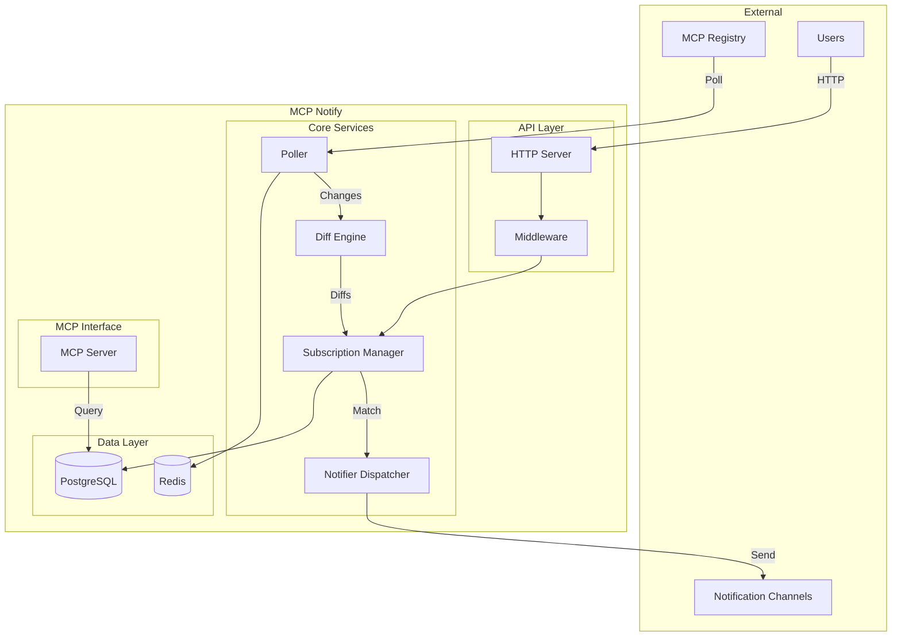
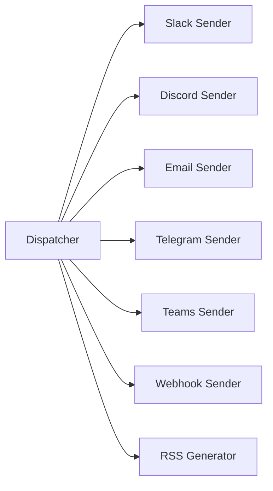
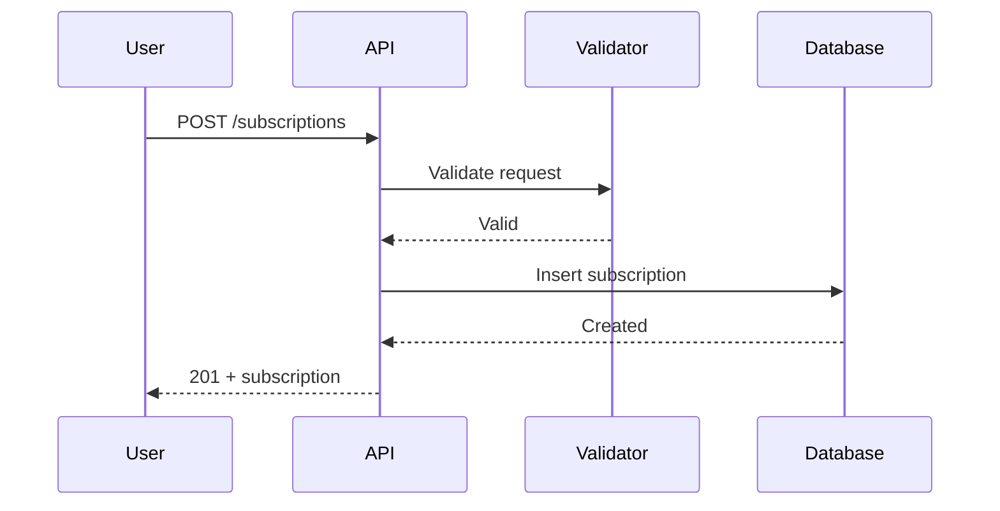
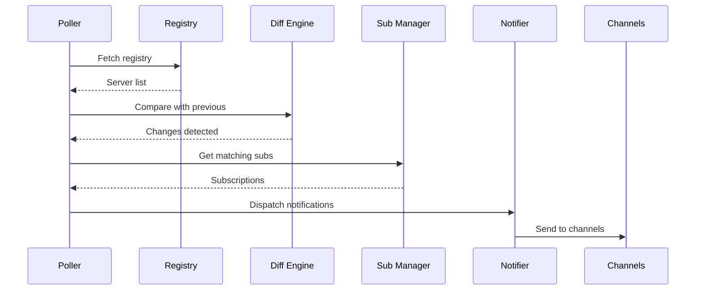
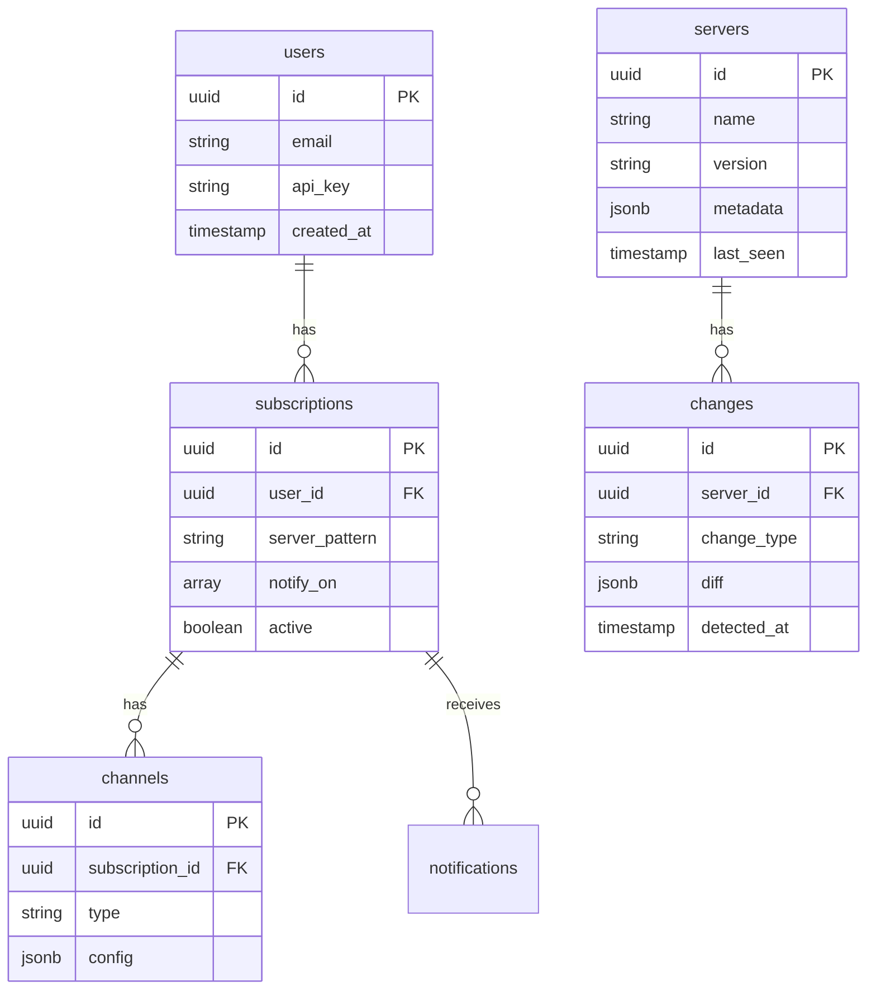
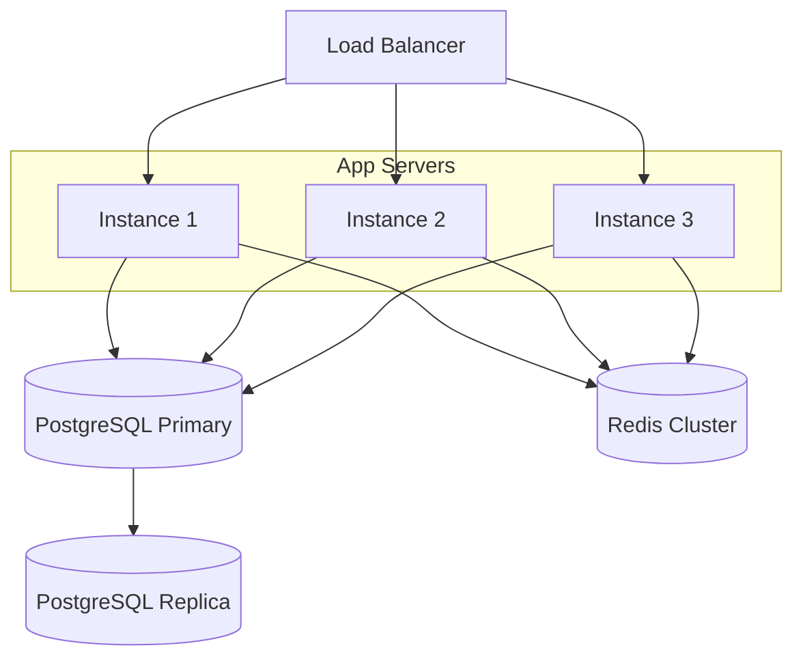

# Architecture

Technical architecture and design decisions for MCP Notify.

## System Overview



## Components

### Poller

The poller fetches the MCP Registry at configurable intervals.

```go
type Poller struct {
    interval time.Duration
    client   *registry.Client
    cache    *redis.Client
}
```

**Responsibilities:**

- Fetch registry data on schedule
- Store snapshots for diffing
- Detect network failures and retry

### Diff Engine

Compares registry snapshots to detect changes.

```go
type DiffEngine struct {
    storage Storage
}

type Change struct {
    Type       ChangeType  // New, Updated, Removed
    ServerName string
    OldData    *Server
    NewData    *Server
    Fields     []FieldDiff
}
```

**Change Detection:**

| Change Type | Detection Method |
|-------------|------------------|
| New Server | Present in new, absent in old |
| Removed Server | Present in old, absent in new |
| Updated Server | Deep comparison of fields |

### Subscription Manager

Manages user subscriptions and matches changes.

```go
type SubscriptionManager struct {
    db      *postgres.Client
    matcher PatternMatcher
}

type Subscription struct {
    ID            string
    UserID        string
    ServerPattern string    // Glob pattern
    NotifyOn      []ChangeType
    Channels      []Channel
    Active        bool
}
```

**Pattern Matching:**

- Glob patterns: `claude-*`, `*-database`, `filesystem`
- Regex patterns: `^(claude|anthropic)-.*$`
- Exact match: `filesystem`

### Notifier Dispatcher

Routes notifications to configured channels.



Each sender implements the `Sender` interface:

```go
type Sender interface {
    Send(ctx context.Context, notification Notification) error
    Type() string
}
```

### API Server

RESTful HTTP API built with Go's standard library.

**Middleware Stack:**

```
Request → Logging → Auth → RateLimit → Handler → Response
```

| Middleware | Purpose |
|------------|---------|
| Logging | Request/response logging |
| Auth | API key validation |
| RateLimit | Request throttling |

### MCP Server

Implements the Model Context Protocol for AI assistant integration.

```go
type MCPServer struct {
    sdk *mcp.Server
    db  *postgres.Client
}
```

**Transport:** stdio (standard input/output)

**Tools Provided:**

- `search_servers` - Search by keyword
- `get_server` - Get server details
- `list_servers` - List all servers
- `get_stats` - Registry statistics

## Data Flow

### Subscription Creation



### Change Detection & Notification



## Database Schema

### Core Tables



## Caching Strategy

### Redis Usage

| Key Pattern | Data | TTL |
|-------------|------|-----|
| `registry:snapshot` | Latest registry | 5m |
| `registry:hash` | Content hash | 5m |
| `server:{name}` | Server details | 1h |
| `ratelimit:{ip}` | Request count | 1m |

### Cache Invalidation

- Snapshot cache invalidated on new poll
- Server cache invalidated on change detection
- Rate limit counters auto-expire

## Scalability

### Horizontal Scaling



### Considerations

- **Poller**: Only one instance should poll (use leader election)
- **API**: Stateless, can scale horizontally
- **Notifier**: Queue-based for reliability

## Security

### Authentication

```
Authorization: Bearer <api-key>
```

API keys are hashed with bcrypt and stored in PostgreSQL.

### Rate Limiting

| Endpoint | Limit |
|----------|-------|
| `/api/*` | 100/min |
| `/auth/*` | 10/min |
| `/webhooks/*` | 1000/min |

### Data Protection

- Webhook URLs encrypted at rest
- API keys hashed
- TLS required in production
