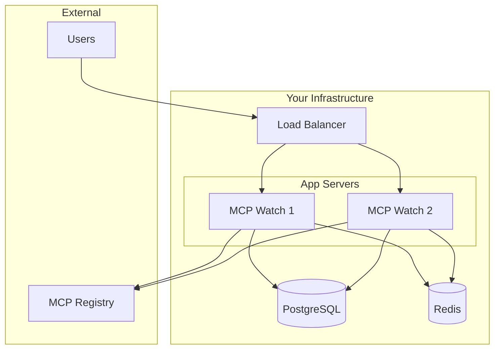

# Deployment Guide

Deploy MCP Notify to your infrastructure.

<div class="grid cards" markdown>

-   :simple-vercel:{ .lg .middle } **Vercel**

    ---

    Deploy the documentation site to Vercel

    [:octicons-arrow-right-24: Vercel Guide](vercel-docs.md)

-   :simple-railway:{ .lg .middle } **Railway**

    ---

    One-click deployment to Railway

    [:octicons-arrow-right-24: Railway Guide](railway.md)

-   :material-train-car-container:{ .lg .middle } **Docker**

    ---

    Deploy with Docker Compose or standalone containers

    [:octicons-arrow-right-24: Docker Guide](docker.md)

-   :simple-kubernetes:{ .lg .middle } **Kubernetes**

    ---

    Production Kubernetes deployment with Helm

    [:octicons-arrow-right-24: Kubernetes Guide](kubernetes.md)

</div>

## Quick Comparison

| Platform | Best For | Difficulty | Cost |
|----------|----------|------------|------|
| **Vercel** | Documentation site | ⭐ Easy | Free |
| **Railway** | API + Full stack | ⭐ Easy | Free tier |
| **Docker Compose** | Self-hosted, development | ⭐⭐ Medium | Your infra |
| **Kubernetes** | Production, scale | ⭐⭐⭐ Advanced | Variable |

## Minimum Requirements

| Component | Minimum | Recommended |
|-----------|---------|-------------|
| **CPU** | 1 core | 2 cores |
| **Memory** | 512 MB | 1 GB |
| **Storage** | 1 GB | 10 GB |
| **PostgreSQL** | 14+ | 15+ |
| **Redis** | 6+ | 7+ |

## Architecture Overview



## Environment Variables

All deployment methods use these environment variables:

### Required

| Variable | Description |
|----------|-------------|
| `DATABASE_URL` | PostgreSQL connection string |
| `REDIS_URL` | Redis connection string |

### Optional

| Variable | Default | Description |
|----------|---------|-------------|
| `PORT` | `8080` | HTTP server port |
| `API_KEY` | - | API authentication key |
| `LOG_LEVEL` | `info` | Logging level |
| `POLL_INTERVAL` | `5m` | Registry poll interval |
| `METRICS_ENABLED` | `true` | Enable Prometheus metrics |

## Health Checks

All deployments should configure health checks:

- **Liveness**: `GET /health`
- **Readiness**: `GET /ready`

```bash
# Check health
curl http://localhost:8080/health
# {"status": "healthy"}

# Check readiness
curl http://localhost:8080/ready
# {"status": "ready", "database": "ok", "redis": "ok"}
```

## Database Migrations

Migrations run automatically on startup. To run manually:

```bash
mcp-notify migrate up
```

Or with Docker:

```bash
docker run --rm \
  -e DATABASE_URL="..." \
  ghcr.io/nirholas/mcp-notify:latest \
  migrate up
```

## Security Considerations

!!! warning "Production Checklist"

    - [ ] Use strong API keys
    - [ ] Enable TLS/HTTPS
    - [ ] Restrict database access
    - [ ] Set up network policies
    - [ ] Configure rate limiting
    - [ ] Enable audit logging
    - [ ] Regular backups
