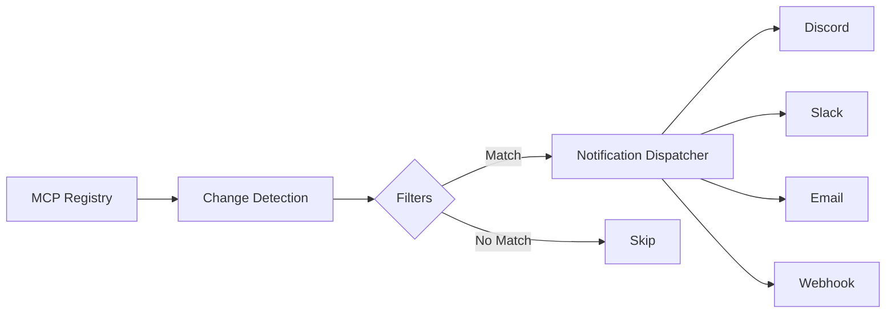

# Your First Subscription

This guide walks you through creating a subscription with filters, choosing notification channels, and managing your alerts.

## Understanding Subscriptions

A subscription consists of:

1. **Filters** - What changes you want to be notified about
2. **Channels** - Where to send notifications (Discord, Slack, etc.)
3. **Settings** - Digest frequency, notification limits, etc.



## Filter Options

### By Namespace

Filter servers by their namespace prefix:

```bash
mcp-notify-cli subscribe discord \
  --webhook-url "..." \
  --namespaces "defi,trading,finance"
```

### By Keywords

Match servers containing specific keywords in name or description:

```bash
mcp-notify-cli subscribe discord \
  --webhook-url "..." \
  --keywords "database,sql,postgres,mysql"
```

### By Change Type

Only notify for specific types of changes:

| Type | Description |
|------|-------------|
| `new` | New server added to registry |
| `updated` | Existing server was updated |
| `removed` | Server was removed from registry |

```bash
mcp-notify-cli subscribe discord \
  --webhook-url "..." \
  --change-types "new"  # Only new servers
```

### Combined Filters

Filters are combined with AND logic:

```bash
mcp-notify-cli subscribe discord \
  --webhook-url "..." \
  --namespaces "ai" \
  --keywords "llm,gpt" \
  --change-types "new,updated"
```

This will notify you only when:

- Server is in the `ai` namespace, **AND**
- Server name/description contains "llm" or "gpt", **AND**
- Change type is "new" or "updated"

## Creating via API

For more control, use the REST API:

```bash
curl -X POST http://localhost:8080/api/v1/subscriptions \
  -H "Content-Type: application/json" \
  -d '{
    "name": "AI Tools Monitor",
    "description": "Track AI-related MCP servers",
    "filters": {
      "namespaces": ["ai", "ml"],
      "keywords": ["llm", "gpt", "claude", "openai"],
      "change_types": ["new", "updated"]
    },
    "channels": [
      {
        "type": "discord",
        "config": {
          "webhook_url": "https://discord.com/api/webhooks/..."
        }
      },
      {
        "type": "email",
        "config": {
          "email": "alerts@example.com",
          "digest": "daily"
        }
      }
    ]
  }'
```

The response includes your API key for managing the subscription:

```json
{
  "id": "sub_abc123",
  "name": "AI Tools Monitor",
  "api_key": "mcp_xxxxxxxxxxxx",
  "status": "active",
  "created_at": "2026-01-05T10:00:00Z"
}
```

!!! warning "Save Your API Key"
    The API key is only shown once. Store it securely!

## Managing Subscriptions

### List Subscriptions

```bash
mcp-notify-cli subscriptions list
```

### View Details

```bash
mcp-notify-cli subscriptions show sub_abc123
```

### Pause/Resume

```bash
# Pause notifications
mcp-notify-cli subscriptions pause sub_abc123

# Resume notifications
mcp-notify-cli subscriptions resume sub_abc123
```

### Test Notification

Send a test notification to verify your setup:

```bash
mcp-notify-cli subscriptions test sub_abc123
```

### Delete

```bash
mcp-notify-cli subscriptions delete sub_abc123
```

## Digest Options

For email subscriptions, configure digest frequency:

| Frequency | Description |
|-----------|-------------|
| `immediate` | Send each change as it's detected |
| `hourly` | Batch changes every hour |
| `daily` | Daily summary at 9 AM UTC |
| `weekly` | Weekly summary on Mondays |

```bash
mcp-notify-cli subscribe email \
  --email "you@example.com" \
  --digest daily
```

## Best Practices

!!! tip "Start Broad, Then Narrow"
    Start with fewer filters to see what's available, then add filters to reduce noise.

!!! tip "Use Multiple Channels"
    Set up immediate Discord notifications for critical alerts, and daily email digests for summaries.

!!! tip "Test Before Production"
    Always use the test command to verify your webhook is working.

## Next Steps

- [Explore all notification channels →](../channels/index.md)
- [Learn about the API →](../api/subscriptions.md)
- [Set up digest emails →](../channels/email.md)
